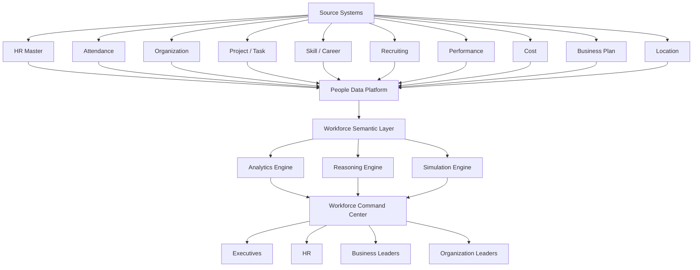

# Strategic Workforce Intelligence Platform
## 통합 인력운영 추론 시스템 구축 설계안

---

## 0. Executive Summary

본 시스템은 단순한 HR 통합 데이터베이스나 인력 현황 Dashboard가 아니다.

**전사 인력·조직·업무·과제·근태·역량·원가 데이터를 하나의 구조로 연결하여, 현재의 인력 구조를 실시간으로 이해하고, 미래 사업계획에 필요한 인력 수요를 예측하며, 인력 배치·충원·재배치·조직운영 의사결정을 지원하는 AI 기반 Workforce Intelligence Platform**을 목표로 한다.

궁극적으로 시스템은 다음 질문에 답할 수 있어야 한다.

- 현재 우리 회사의 인력은 어디에, 어떤 형태로 배치되어 있는가?
- 어떤 조직/직군/거점/과제에서 인력 구조가 빠르게 변하고 있는가?
- 왜 특정 조직의 인력이나 근로시간이 증가하고 있는가?
- 향후 사업계획을 고려했을 때 어느 영역에서 인력이 부족하거나 과잉될 가능성이 있는가?
- 종료되는 과제의 인력을 어떤 조직이나 신규 과제로 재배치할 수 있는가?
- 인력을 3% 줄이거나 특정 직군을 10% 확대하면 사업·조직에 어떤 영향이 생기는가?
- 채용과 내부 재배치 중 어떤 방식이 더 빠르고 효율적인가?
- 특정 프로젝트에 실제로 필요한 FTE가 얼마이며 현재 투입 수준은 적정한가?

시스템의 최종 지향점은 단순 조회가 아니라 **Workforce Decision Intelligence**이다.

---

# 1. 시스템 정의

## 1.1 시스템 한 문장 정의

> **전사 인력·조직·업무 데이터를 통합하여 현재 인력 구조를 실시간으로 파악하고, 미래 사업계획에 필요한 인력 수요를 예측하며, 최적의 인력 배치 의사결정을 지원하는 AI 기반 Workforce Intelligence Platform**

---

## 1.2 기존 HR 시스템과의 차이

| 구분 | 기존 HR 시스템 | Workforce Intelligence Platform |
|---|---|---|
| 목적 | 인사 업무 처리 | 인력운영 의사결정 |
| 데이터 | 인사정보 중심 | 인사 + 과제 + 조직 + 사업 + Skill + Cost |
| 분석 | 현황 조회 | 원인 분석 + 예측 + 시뮬레이션 |
| 기준 | 개인/조직 | 개인 + 조직 + 직무 + 과제 + Skill + 시간 |
| 질문 | "현재 몇 명인가?" | "왜 늘었고 앞으로 얼마나 필요한가?" |
| 활용자 | HR 중심 | 경영진 + 사업부 + 조직장 + HR |
| AI 역할 | 검색/요약 | 추론 + 시뮬레이션 + 의사결정 지원 |

---

# 2. 설계 원칙

## 2.1 시스템은 DB가 아니라 "의사결정 시스템"으로 설계한다

구축 순서는 다음과 같아야 한다.

1. 어떤 의사결정을 지원할 것인가?
2. 그 의사결정을 위해 어떤 질문에 답해야 하는가?
3. 그 질문을 위해 어떤 데이터가 필요한가?
4. 데이터를 어떤 기준으로 연결할 것인가?
5. 어떤 분석/추론 모델이 필요한가?
6. 어떤 화면과 UX가 필요한가?

DB부터 구축하면 다음과 같은 문제가 발생할 수 있다.

- 데이터는 많지만 경영진이 물어볼 질문에 답하지 못함
- 조직·직무·과제 간 관계가 연결되지 않음
- Snapshot이 없어 과거 변화 추적이 불가능함
- 과제별 인력 투입이 Headcount만 존재해 실제 FTE 판단이 어려움
- 인사시스템과 업무시스템의 기준정보가 서로 다름

---

## 2.2 Headcount가 아니라 HC + FTE + Skill + Project + Time을 함께 본다

인력운영에서 단순 Headcount만으로는 실제 인력부하와 사업 투입 수준을 판단하기 어렵다.

예:

- 직원 A
  - Project A : 50%
  - Project B : 30%
  - 공통업무 : 20%

직원은 1명이지만 Project A에는 **0.5 FTE**가 투입되어 있는 것이다.

따라서 시스템에서는 최소한 아래 5개 차원을 동시에 관리해야 한다.

> **HC + FTE + Skill + Project + Time**

---

## 2.3 모든 핵심 데이터는 "시점 이력"을 보존한다

현재 상태만 저장해서는 전략적인 분석이 어렵다.

예:

- 2025.01 : AP개발팀 270명
- 2025.07 : AP개발팀 285명
- 2026.01 : AP개발팀 300명
- 2026.09 : AP개발팀 326명

이력을 확보해야 다음 분석이 가능하다.

- 증가/감소 추세
- 조직개편 영향
- 인력 이동 패턴
- 평균 근속 변화
- 관리직 비중 변화
- 특정 직군의 급증/급감
- 과제별 인력투입 변화
- 조직 생산성 변화

---

# 3. 전체 시스템 구조



---

# 4. 데이터 아키텍처

## 4.1 Source Data Layer

### A. 인력 Master

주요 데이터

- 사번
- 이름
- 입사일
- 직급
- 직책
- 직군
- 직무
- 조직
- 근무지
- 고용형태
- 근속연수
- 경력연수
- 전공
- 학위
- 주요 경력

---

### B. 조직 데이터

- 조직 ID
- 조직명
- 상위 조직
- 조직 Level
- 조직장
- 조직 생성일
- 조직 종료일
- 조직 변경 이력
- 조직 정원
- 조직 현원
- Cost Center
- Location

조직 hierarchy 예시

> 사업부 → 개발실 → 팀 → Group → Part

---

### C. 근태 데이터

- 출근
- 퇴근
- 근로시간
- 초과근무
- 야간근무
- 휴일근무
- 휴가
- 출장
- 유연근무
- 재택근무

분석 가능 지표

- 평균 근로시간
- 초과근무 집중도
- 조직별 Workload
- 프로젝트별 근로시간
- Burnout Risk Signal
- 근태 편차

---

### D. Project / Task 데이터

- Project ID
- 과제명
- Product
- Program
- 개발단계
- 시작일
- 종료일
- 목표 일정
- 사업 중요도
- 조직
- Project Owner
- Project Risk
- 투입인원
- FTE

---

### E. Skill 데이터

Skill taxonomy를 반드시 표준화해야 한다.

예:

```text
Engineering
 ├─ HW
 │   ├─ CPU
 │   ├─ GPU
 │   ├─ NPU
 │   ├─ RTL
 │   └─ Verification
 ├─ SW
 │   ├─ Embedded
 │   ├─ Driver
 │   ├─ Compiler
 │   └─ AI
 └─ Algorithm
     ├─ Vision
     ├─ ISP
     └─ ML
```

개인별 Skill 데이터

- Skill
- Level
- 경험기간
- Project 경험
- 교육
- 인증
- 최근 활용시점

---

### F. 인사이동

- 입사
- 전배
- 조직이동
- 승격
- 직무변경
- 휴직
- 복직
- 퇴사

---

### G. 채용

- 채용 Position
- Job
- Skill
- 조직
- 필요인원
- Open Date
- 채용진행상태
- 채용완료
- Time to Hire

---

### H. 인건비

- Salary
- Bonus
- Labor Cost
- 조직별 Cost
- 직군별 Cost
- Project Cost
- Location Cost

---

### I. 성과/평가

민감도가 높은 정보이므로 활용범위를 제한한다.

가능한 활용

- 조직 수준 성과분포
- 고성과 Skill Pool
- 핵심인력 Risk
- 특정 직무 Talent Density

---

### J. 사업계획

Workforce Planning에서 가장 중요한 데이터 중 하나다.

- 사업계획
- 제품 Roadmap
- Project Roadmap
- 개발 일정
- 예상 매출
- 프로젝트 중요도
- 필요 Skill
- 필요 FTE

---

# 5. Workforce Semantic Layer

본 시스템의 핵심은 단순 데이터 통합이 아니라 **관계의 통합**이다.

기본 관계는 다음과 같다.

```text
Employee
  │
  ├── Organization
  ├── Job
  ├── Skill
  ├── Project
  ├── Location
  ├── Attendance
  ├── Career
  └── Cost
```

Project 관점

```text
Project
  │
  ├── Product
  ├── Organization
  ├── Employee
  ├── Skill
  ├── FTE
  ├── Milestone
  └── Business Priority
```

---

## 5.1 Workforce Knowledge Graph

Graph 모델을 적용하면 다음과 같은 추론이 가능하다.

예:

```text
직원 A
 ├─ AP개발팀
 ├─ CPU Design
 ├─ RTL
 ├─ Project Alpha
 ├─ Project Beta
 └─ 수원
```

Project Alpha

```text
Project Alpha
 ├─ Mobile SoC
 ├─ 2027 Q2 Launch
 ├─ AP개발실
 ├─ 65 FTE
 ├─ RTL 23 FTE
 ├─ Verification 31 FTE
 └─ PM 11 FTE
```

이 관계를 통해 시스템은 다음 질문에 답할 수 있다.

> Project Alpha 종료 후 RTL 인력 20명 중 Project Gamma로 이동 가능한 인력은 누구인가?

---

# 6. Workforce Analytics Framework

분석은 5단계로 구성한다.

---

## LEVEL 1 — Visibility

> 사람이 어디에 있는가?

대표 분석

- 총인원
- 조직별 인원
- 직군별 인원
- 직급별 인원
- 거점별 인원
- 과제별 인원
- Skill별 인원

---

## LEVEL 2 — Analytics

> 인력이 어떻게 변화하고 있는가?

대표 분석

- 조직별 증감
- 직군별 증감
- 채용 추이
- 퇴사 추이
- 근로시간 변화
- 조직별 이동률
- Project 투입변화

---

## LEVEL 3 — Diagnosis

> 왜 이런 변화가 발생했는가?

예:

> Verification 인력이 최근 1년간 18% 증가했다.

원인 분석

- 신규 Project 증가
- RTL Project 확대
- 외부 채용
- 조직 이동
- 제품 일정 변경

---

## LEVEL 4 — Prediction

> 앞으로 얼마나 필요할 것인가?

예:

2027 Project Roadmap 분석

| Skill | 현재 | 예상 필요 | Gap |
|---|---:|---:|---:|
| RTL | 320 | 350 | -30 |
| Verification | 410 | 485 | -75 |
| AI SW | 180 | 260 | -80 |

---

## LEVEL 5 — Optimization

> 인력을 어디에서 어디로 이동해야 하는가?

시스템 제안 예:

```text
Project Beta 종료 예정
↓
RTL 24 FTE 확보
↓
Project Gamma 필요 RTL 18 FTE
↓
Skill Match 14명
↓
재배치 추천
```

---

# 7. Reasoning Engine

Reasoning Engine은 다음 4가지 레이어로 구성한다.

## 7.1 Query Understanding

자연어 질문을 분석한다.

예:

> "최근 6개월 인력이 가장 많이 늘어난 조직은?"

분석

- Metric : Headcount
- Dimension : Organization
- Period : 6 months
- Operation : Growth
- Sort : Descending

---

## 7.2 Data Retrieval

필요 데이터 자동 조회

- HR Master
- Organization
- Snapshot
- Movement

---

## 7.3 Analytical Reasoning

필요한 계산 수행

- 증감
- CAGR
- Contribution
- FTE
- 조직 이동
- Skill Gap

---

## 7.4 Explanation

답변은 단순 숫자만 제공하지 않는다.

예:

> 최근 6개월 인력 증가가 가장 큰 조직은 A개발실입니다.  
> 총 42명이 증가했으며 주요 원인은 Project Alpha 확대(+28명)와 신규 채용(+19명)입니다.  
> 반면 타 조직 이동으로 5명이 감소했습니다.

---

# 8. Workforce Simulation Engine

Scenario Planning이 핵심 기능이다.

---

## Scenario 1

> 전체 인력 3% 감소

시스템 분석

| 조직 | 현재 | -3% | 사업필요 | Gap | Risk |
|---|---:|---:|---:|---:|---|
| A개발팀 | 420 | 407 | 440 | -33 | High |
| B개발팀 | 310 | 301 | 290 | +11 | Low |
| C개발팀 | 230 | 223 | 225 | -2 | Medium |

시스템 Insight

> 일괄 3% 감축보다 B개발팀 11 FTE를 A개발팀으로 재배치하는 시나리오가 사업 영향이 낮다.

---

## Scenario 2

> AI 관련 프로젝트 30% 확대

필요 Skill

- AI SW
- NPU
- Compiler
- ML

현재 Skill Pool과 비교하여 Gap 산출

---

## Scenario 3

> Project Alpha 3개월 지연

영향 분석

- Project Beta 투입 지연
- 특정 Skill 재배치 지연
- 추가 Cost
- Workload 증가

---

# 9. 시스템 핵심 화면

# 화면 1. Workforce Command Center

상단 KPI

```text
TOTAL WORKFORCE
8,320

FTE
7,940

OPEN POSITION
312

AVG WORKING HOURS
43.2h

PROJECTS
128
```

중앙 Navigation

- Organization
- Job
- Skill
- Project
- Location

---

## 화면 2. Organization Explorer

조직 Tree

```text
System LSI
 ├─ AP
 │   ├─ CPU
 │   ├─ GPU
 │   └─ NPU
 ├─ CIS
 └─ Platform
```

조직 선택 시 표시

- 총인원
- FTE
- 직군 구성
- 평균 근속
- 근로시간
- 채용
- 이동
- 프로젝트

---

## 화면 3. Workforce Map

X축

> Organization

Y축

> Job / Skill

Bubble Size

> Headcount

Color

> Growth / Risk

이를 통해 특정 조직의 Skill 집중도를 직관적으로 확인한다.

---

## 화면 4. Project Workforce

Project별

- HC
- FTE
- Skill
- 조직
- Milestone
- 예상 종료일

예

```text
Project Alpha

Total 65 FTE

RTL            23
Verification   31
PM             11
```

---

## 화면 5. Skill Map

예

```text
Verification

Total : 850

AP        320
CIS       210
Platform  180
Others    140
```

Skill Level

```text
Expert      72
Advanced   280
Intermediate 360
Junior     138
```

---

## 화면 6. Workforce Flow

조직간 이동 시각화

```text
AP → Platform
Platform → AI
CIS → AP
```

Sankey Chart 활용 가능

---

## 화면 7. Workforce Forecast

예

```text
2026      8,320
2027      8,610
2028      8,780
```

동시에

- 사업 필요인력
- 자연감소
- 채용
- 이동
- Gap

표시

---

## 화면 8. Scenario Planning

사용자가 직접 조건 입력

```text
Total HC -3%
AI HC +20%
Verification +50
Project Beta 종료
```

즉시 영향 분석

---

## 화면 9. Ask Workforce AI

예시 질문

> 최근 6개월 인력이 가장 많이 증가한 조직은?

> 평균 근로시간이 높은 조직 Top 10 보여줘.

> Project Alpha 종료 후 이동 가능한 인력을 찾아줘.

> 2027년 Verification 인력 부족 예상 규모는?

> AI 관련 Skill을 가진 직원은 몇 명인가?

---

# 10. 경영진이 시스템에 물어볼 수 있는 질문 50개

## A. 전체 인력 구조

1. 현재 전체 인력은 몇 명인가?
2. 최근 1년간 인력은 얼마나 증가했는가?
3. 조직별 인력 규모는 어떻게 되는가?
4. 직군별 인력 구성은 어떻게 되는가?
5. 거점별 인력은 어떻게 분포되어 있는가?
6. 최근 3년간 인력 구조가 어떻게 변화했는가?
7. 관리직 비중이 가장 높은 조직은 어디인가?
8. 평균 근속연수가 가장 높은 조직은 어디인가?
9. Senior 인력 비중이 높은 조직은 어디인가?
10. 신규입사자 비중이 높은 조직은 어디인가?

## B. 조직 운영

11. 최근 1년간 가장 빠르게 성장한 조직은 어디인가?
12. 인력이 감소하고 있는 조직은 어디인가?
13. 조직별 평균 Span of Control은 얼마인가?
14. 관리계층이 과도하게 많은 조직은 어디인가?
15. 최근 조직 이동이 가장 많은 조직은 어디인가?
16. 조직 간 인력 이동 패턴은 어떻게 되는가?
17. 특정 조직에서 타 조직으로 이동하는 주요 직군은 무엇인가?
18. 조직별 채용 의존도는 얼마나 되는가?
19. 조직별 내부 이동 비율은 얼마인가?
20. 조직별 인력 증가 원인은 무엇인가?

## C. 근태 / Workload

21. 평균 근로시간이 가장 높은 조직은?
22. 초과근무가 지속적으로 증가하는 조직은?
23. 특정 과제에 근로시간이 집중되는 조직은?
24. 특정 Skill 인력의 Workload가 과도한 곳은?
25. 장시간 근로가 장기간 지속되는 인력군은?
26. 휴가 사용률이 낮은 조직은?
27. 프로젝트 일정과 근로시간 증가가 연관되는가?

## D. Project

28. Project Alpha에 실제 몇 명이 투입되어 있는가?
29. Project별 FTE는 얼마인가?
30. 특정 프로젝트의 핵심 Skill은 무엇인가?
31. 과제별 인력 구성은 적정한가?
32. 프로젝트 종료 후 가용 인력은 얼마나 발생하는가?
33. 프로젝트 종료 인력을 어디에 재배치할 수 있는가?
34. 신규 프로젝트에 필요한 Skill은 현재 내부에 얼마나 존재하는가?
35. Project별 인건비는 얼마인가?
36. 여러 프로젝트에 중복 투입된 인력은 얼마나 되는가?

## E. Skill

37. AI 관련 Skill을 가진 인력은 몇 명인가?
38. Verification Expert는 어디에 있는가?
39. 특정 Skill이 특정 조직에 과도하게 집중되어 있는가?
40. 특정 Skill의 평균 경력은 얼마인가?
41. 신규 사업을 위해 부족한 Skill은 무엇인가?
42. 향후 3년간 부족 가능성이 높은 Skill은?

## F. Workforce Planning

43. 2027년 사업계획을 기준으로 필요한 인력은 몇 명인가?
44. 현재 계획 대비 부족 인력은 얼마인가?
45. 내부 재배치로 충원 가능한 규모는?
46. 외부 채용이 반드시 필요한 직군은 무엇인가?
47. 전체 인력 3% 감소 시 사업 영향은?
48. AI 조직을 20% 확대하면 어디에서 인력을 확보할 수 있는가?
49. 특정 거점을 축소할 경우 영향은?
50. 향후 3년 Workforce Plan을 최적화하면 어떤 구조가 되는가?

---

# 11. 핵심 데이터 모델

## 11.1 주요 Entity

### Employee

```text
employee_id
organization_id
job_id
grade_id
location_id
hire_date
employment_type
```

---

### Organization

```text
organization_id
parent_org_id
organization_name
organization_level
manager_id
effective_date
end_date
```

---

### Job

```text
job_id
job_family
job
job_level
```

---

### Skill

```text
skill_id
skill_category
skill_name
skill_level
```

---

### Employee Skill

```text
employee_id
skill_id
skill_level
experience_year
last_used_date
```

---

### Project

```text
project_id
project_name
product
priority
start_date
end_date
owner
```

---

### Project Assignment

```text
employee_id
project_id
fte
start_date
end_date
role
```

---

### Attendance

```text
employee_id
date
working_hours
overtime_hours
leave
```

---

### Workforce Snapshot

```text
snapshot_date
employee_id
organization_id
job_id
location_id
grade_id
```

---

# 12. 핵심 KPI

## Workforce Structure

- Headcount
- FTE
- HC Growth
- HC Mix
- Senior Ratio
- Manager Ratio

## Workforce Flow

- Hiring Rate
- Attrition Rate
- Internal Mobility
- Transfer Rate

## Workload

- Average Working Hours
- Overtime
- Workload Index
- Leave Utilization

## Project

- Project HC
- Project FTE
- Multi Project Ratio
- Project Skill Gap

## Skill

- Skill HC
- Skill Coverage
- Expert Ratio
- Skill Concentration

## Planning

- Demand
- Supply
- Gap
- Hiring Need
- Redeployment Capacity

---

# 13. AI 구조

추천 구조는 다음과 같다.

```text
User
↓
Workforce AI
↓
Intent Parser
↓
Semantic Layer
↓
SQL / Graph Query
↓
Analytics Engine
↓
Reasoning Engine
↓
Answer
```

중요 원칙

LLM이 직접 데이터베이스를 자유롭게 조회하도록 하지 않는다.

대신

```text
LLM
↓
Semantic Query
↓
Approved Metrics
↓
Data Engine
```

구조를 사용해야 한다.

이렇게 해야

- 숫자 오류
- Metric 정의 불일치
- 개인정보 노출
- 잘못된 Query

를 줄일 수 있다.

---

# 14. 권한 / Security

HR 데이터 특성상 Role Based Access Control이 필수다.

예

### CEO

전체 조직

### 사업부장

사업부 범위

### 팀장

자신의 조직

### HR

업무 필요 범위

### 일반 직원

제한된 통계

---

## 민감정보

AI Query에서 직접 노출 제한

- 개인 평가
- 보상
- 건강정보
- 징계
- 민감 개인정보

개인 단위 분석보다

> 조직 / 직군 / Skill Cluster

단위 분석을 기본으로 한다.

---

# 15. Data Governance

본 시스템의 성패는 AI보다 데이터 Governance에 달려 있다.

반드시 정의해야 한다.

### Golden Source

예

| 데이터 | 기준 시스템 |
|---|---|
| Employee | HR |
| Organization | HR |
| Attendance | 근태 |
| Project | PM |
| Skill | Skill DB |
| Cost | Finance |

---

## Metric Definition

예

### Headcount

특정 시점 기준 재직자

### FTE

Project Assignment 비율 합산

### Attrition

기간 내 퇴사자 / 평균 인원

같은 지표 정의를 회사 전체에서 통일해야 한다.

---

# 16. 구축 로드맵

## Phase 1 — Workforce Visibility

기간 예시

3~4개월

구축

- 인력 Master
- 조직
- 직군
- 근태
- Snapshot
- 기본 Dashboard

목표

> 전사 인력 현황 Single Source of Truth 확보

---

## Phase 2 — Project Workforce

추가

- Project
- Project Assignment
- FTE
- Skill

목표

> 사람이 아니라 "일과 연결된 인력" 관리

---

## Phase 3 — Workforce Intelligence

추가

- AI Query
- Trend
- Diagnosis
- Workforce Flow
- Skill Analytics

목표

> Why 분석

---

## Phase 4 — Workforce Planning

추가

- Business Plan
- Workforce Demand
- Skill Demand
- Forecast

목표

> Future Workforce Planning

---

## Phase 5 — Workforce Optimization

추가

- Scenario Planning
- Redeployment
- Skill Matching
- Workforce Optimization

목표

> AI 기반 Workforce Decision Intelligence

---

# 17. MVP 권장 범위

처음부터 모든 데이터를 넣으려고 하면 구축 난도가 급격히 상승한다.

MVP는 다음 6개 영역으로 시작하는 것을 권장한다.

1. Employee
2. Organization
3. Job
4. Attendance
5. Project
6. Project Assignment / FTE

이 데이터만으로도 다음이 가능하다.

- 조직별 인력
- 직군별 인력
- Project별 인력
- 근로시간
- Project FTE
- 인력 이동
- 조직 변화
- Workforce AI 기본 질의

이후 Skill / Recruiting / Cost / Business Plan을 확장한다.

---

# 18. 구현 우선순위

가장 먼저 해야 할 작업은 시스템 개발이 아니다.

다음 4가지를 먼저 정의해야 한다.

## 1. Workforce Decision List

회사가 실제로 인력운영에서 내리는 주요 의사결정을 정의한다.

예

- 신규 프로젝트 인력배치
- 조직 인력 증원
- 채용 승인
- 프로젝트 종료 인력 재배치
- 조직 구조조정
- 거점 인력 운영

---

## 2. Executive Question Library

경영진이 자주 물어보는 질문을 수집한다.

최소 100개 수준으로 구축한다.

---

## 3. Workforce Metric Dictionary

예

```text
HC
FTE
Turnover
Hiring
Manager Ratio
Skill Coverage
Project Load
```

각 Metric 정의를 확정한다.

---

## 4. Workforce Entity Model

핵심 관계

```text
Employee
Organization
Job
Skill
Project
Location
Time
```

를 회사 표준으로 정의한다.

---

# 19. 프로젝트 성공 조건

성공 여부는 다음 질문으로 판단할 수 있다.

기존

> "AP개발실 인원이 몇 명이야?"

성공한 시스템

> "AP개발실 인력이 최근 2년간 18% 증가했는데, 증가 원인의 67%는 Project Alpha와 Beta에 투입된 Verification/RTL 인력이며, 두 프로젝트가 종료되는 2027년 Q2 이후 약 38 FTE가 가용화될 가능성이 있습니다. 이 중 24 FTE는 Project Gamma Skill Requirement와 매칭됩니다."

즉

> **Data → Information → Insight → Decision**

으로 발전해야 한다.

---

# 20. 권장 최종 구조

```text
                 WORKFORCE COMMAND CENTER

                          │
                Ask Workforce AI
                          │
          ┌───────────────┼───────────────┐
          │               │               │
       Analytics       Reasoning       Simulation
          │               │               │
          └───────────────┼───────────────┘
                          │
                Workforce Semantic Layer
                          │
      ┌───────────────────┼───────────────────┐
      │         │         │        │          │
 Employee   Organization  Job    Skill     Project
      │         │         │        │          │
      └───────────────────┼───────────────────┘
                          │
                People Data Platform
                          │
      ┌───────────────────┼───────────────────┐
      │        │          │        │          │
      HR    Attendance   Project  Cost    Business
```

---

# 21. 최종 방향

이 플랫폼은 HR용 Dashboard가 아니라 회사의 전략적 인력운영을 지원하는 경영 의사결정 시스템이어야 한다.

최종적으로 다음 네 가지 질문에 즉시 답할 수 있어야 한다.

### 1. Where are our people?

사람이 어디에 있는가?

### 2. What are they working on?

무슨 일을 하고 있는가?

### 3. What capabilities do we have?

어떤 역량을 가지고 있는가?

### 4. What workforce will we need?

앞으로 어떤 인력이 필요한가?

그리고 가장 마지막 질문은

> **How should we move our people?**

즉,

> **어떤 인력을 어디에 배치하는 것이 회사 전체 관점에서 가장 효과적인가?**

가 되어야 한다.

이 질문까지 답할 수 있을 때 본 시스템은 단순 HR System을 넘어 **Strategic Workforce Intelligence Platform**이 된다.

---

# 22. 다음 설계 과제

실제 구축 단계에서는 아래 산출물을 순차적으로 작성할 것을 권장한다.

1. 시스템 Concept Paper
2. Executive Question Library
3. Workforce KPI Dictionary
4. Enterprise Workforce Data Model
5. Source-to-Target Data Mapping
6. Workforce Ontology / Semantic Model
7. Security & Access Matrix
8. Workforce AI Prompt / Tool Architecture
9. Dashboard Wireframe
10. Scenario Planning Model
11. MVP Scope Definition
12. 12개월 구축 Roadmap
13. 운영 조직 / Governance Model

---

## Appendix. 핵심 철학

이 시스템의 목적은 "인사 데이터를 한 곳에 모으는 것"이 아니다.

목적은

> **회사의 사람과 일이 어떻게 연결되어 있는지를 이해하는 것**

이며,

궁극적으로는

> **사업전략과 인력전략을 하나의 데이터 구조에서 연결하는 것**

이다.
